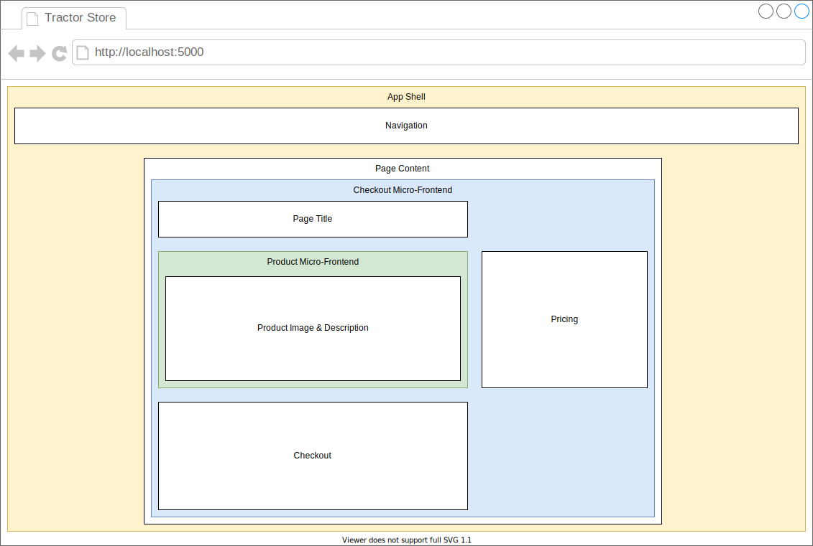
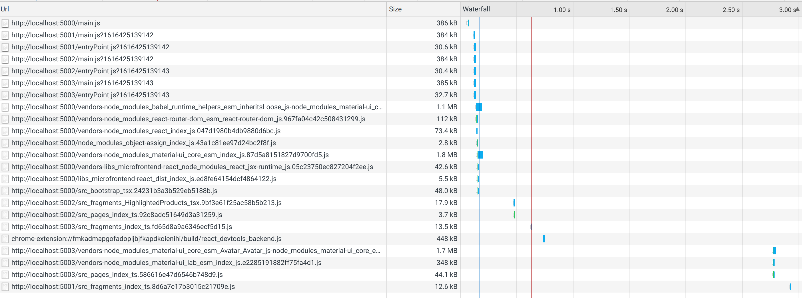

# Micro Frontends Example (v2021)

This repository contains a micro frontend example implementation based on [webpack Module Federation](https://webpack.js.org/concepts/module-federation/).

## Used Technologies

This repository uses different technologies to implement an example store that sells tractors.

- [React](https://reactjs.org/) is used to render the frontend.
- [Material UI](https://material-ui.com/) is used to build a nice looking interface based on the [Material Design](https://material.io/design) principles.
- [webpack](https://webpack.js.org/) is used to build each micro frontend and the app shell.
- [Module Federation](https://webpack.js.org/concepts/module-federation/) is used to load the micro frontends dynamically during runtime execution.
- [TypeScript](https://www.typescriptlang.org/) is used to write type-safe code that is later transpiled to JavaScript.

## Architecture

This repository contains only frontend code, a backend is simulated using a shared library that contains all required "data" for the frontends to display any meaningful information.

The frontend itself is split into separate modules that can be indepently developed by different teams. This is the [micro frontend architecture pattern](https://micro-frontends.org/).

### Pages & Fragments

The following diagram shows a high level view of the architecture itself.



- The app shell contains basic components like navigation and a container to display the page content.
- The correct page content is determined based on the current route of the browser.
- The page content is side loaded from the respective micro-frontend.\
  In this case the checkout page is loaded from the checkout micro-frontend.
- The page itself can load fragments from other micro-frontends.\
  In this case the product image & description is loaded from the product micro-frontend.

### Available (Micro-)Frontends & Libraries

The tractor store is split into multiple micro-frontends and some utility libraries.

#### Frontends

- The [app-shell](frontends/app-shell) handles navigation, integration of micro-frontends and routing.
- The [inspire micro-frontend](frontends/inspire) allows other teams to integrate customized recommendations based on the users interests. This can be developed by a separate team.
- The [product micro-frontend](frontends/product) allows the user to discover the details of a product, this could also include reviews of the product (and that could be later on extracted into a separate micro-frontend).
- The [checkout micro-frontend](frontends/checkout) is responsible for actual functionality to buy the product amd mange the orders a user has done previously.

### Utility Libraries

- [fake-backend](libs/fake-backend) contains all product information as a replacement for real backend services.
- [microfrontend-react](libs/microfrontend-react) adds common functionality that is required to integrate well into the app-shell. This includes a wrapper to easily import other pages and fragments. And a function to allow all fragments and pages navigate to other routes.
- [webpack-utils](libs/webpack-utils) includes utility functions to reduce the amount of configuration required for each micro-frontend's webpack configuration.

### Communication

#### Page to Fragment Communication

A page that includes other fragments might have the requirement to pass some context into the fragment. This is done through React props. Below is an abstract defintion of JSX for each fragment.

##### `<AppShell />`

```xml
<header />
<content>
  <CheckoutPage productId="fendt-f20" />
</content>
```

##### `<CheckoutPage productId="string" />`

```xml
<!-- product = products[props.productId] -->
<h1>Buy A Tractor</h1>
<ProductDetailsFragment productId="${product.id}" />
<p>Price: ${product.price} $</p>
...
```

##### `<ProductDetailsFragment productId="string" />`

```xml
<!-- product = products[props.productId] -->
<h1>${product.name}</h1>

```

### Module Federation

This chapter explains how the module federations works.

#### Initial Bundle Loading

Module Federation requires the information about what modules are available before it is possible to import a federated module. Therefore the application loads the module information by injecting the JavaScript file `entryPoint.js` from each micro-frontend.


#### Loading Dependencies and Modules

Webpack is now able to resolve all modules that are remotely defined in micro-frontends. It is also able to automatically discover which dependencies are already loaded by another frontend and it will re-use the already loaded JavaScript code, if possible.


#### Loading Additional Dependencies

When importing a module, that has an unsatisfied dependency, webpack will now automatically load the required JavasScript code to satisfy all required dependency needs.


#### Example Network Traffic

The above example can be seen as network traffic below.

(Note: `main.js` is only side-loaded from micro-frontends to enable hot-reloading support for each micro-frontend, for module federation alone this wouldn't be required.)



## Future Improvements

Such a project is never complete. ;-) The following list gives an overview what could be improved.

- [ ] Implement a real backend for each micro frontend, or add a unified API that allows all frontends to access the right data for their need (e.g. using one unified GraphQL API).
- [ ] Extract the webpack build configuration into a separate module to simplify the setup for a new micro frontend.
- [ ] Add a build process via GitHub actions that builds each micro frontend in a separate job. This would better show the full power of independent build & deployment of each frontend. (It is already working like it should, but the build process currently does not show this very well.)
- [ ] Each micro frontend exposes components that can be imported by other micro frontends. While the code itself is type-safe (through TypeScript) the code imports are totally dynamic an types need to be predicted by the consuming side. Some kind of registry could be used to detect type mismatches. (An approach like Apollo Federation is using could be used a inspiration.)
